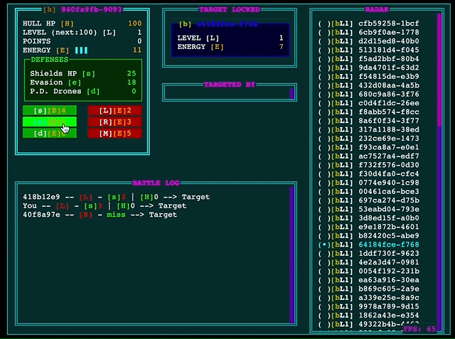

# I've Seen Things (IST)

> title attribution: <https://en.wikipedia.org/wiki/Tears_in_rain_monologue>

I've seen things is a multiplayer browser game implemented in [Elixir](https://elixir-lang.org/), [Phoenix LiveView](https://www.phoenixframework.org/) and [Surface](https://surface-ui.org/getting_started) using the [Ecspanse](https://hexdocs.pm/ecspanse/Ecspanse.html) library. The terminal graphics are done with the [tuicss](https://github.com/vinibiavatti1/TuiCss/wiki/Getting-Started) package.

The game is currenly deployed on [fly.io](https://fly.io) and can be played [HERE](https://iveseenthings.fly.dev/).



**Disclaimer!** While the game is playable, you should not take it too seriously. It was mainly used as a playground while developing the [Ecspanse](https://hexdocs.pm/ecspanse/Ecspanse.html) library. It aims to implement a paper-rock-scissors style game with 3 offensive and 3 defensive operations. However, it is not really balanced at this point.

It's main purpose is to act as a demo for the library and to show how to use it in a real world application. As it was built together with the library it has a lot of rough edges. But it can still display a lot of the library's use cases.

## The Game

The game is a multiplayer space combat game. It is a free for all style game. It features also 100 bots acting as enemise when there are no other players online.

You can perform 3 offensive and 3 defensive operations.

The offensive operations are:

- fire laser
- fire railgun
- fire missile

The defensive operations are:

- activate shiled
- perform evasive maneuver
- spawn defense drone

Each action consumes energy. The energy regenerates orver time.

## Runng the Project Locally

### Secrets

Create a `dev.secret.exs` file in the `config` directory with the following content:

```elixir
import Config
config :iveseenthings, :basic_auth, username: "user", password: "password"
```

This is needed to access the live dashboard locally.

### Phoenix Server

To start your Phoenix server:

- Install dependencies with `mix deps.get`
- Start Phoenix endpoint with `mix phx.server` or inside IEx with `iex -S mix phx.server`

Now you can visit [`localhost:4000`](http://localhost:4000) from your browser.
